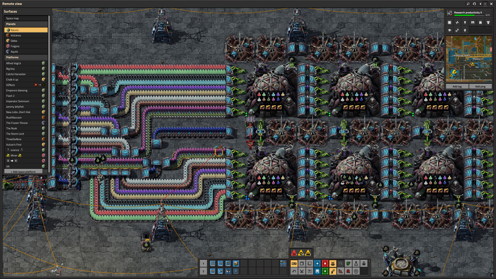
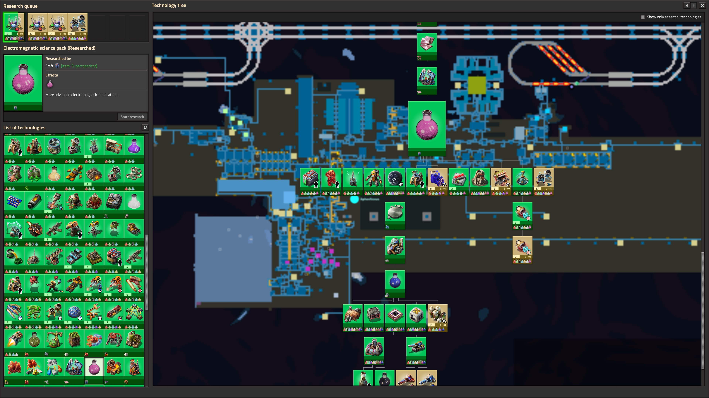

= Photoreal Science Packs
:toc: left
:toclevels: 3

== Summary

This is my first link:https://factorio.com/[Factorio] link:https://mods.factorio.com/[mod]. It is a reskin of the base and Space Age science packs. It updates the items, recepies, and research icons.

=== Acknowledgements

My brother _strongly_ encouraged me to make this mod and I want to give him credit for that. I have been learning Blender over the past few years with a focus on photorealism. I really love the Factorio art style, but I wanted to see what the game would look like with my own touch. So this is the first attempt at putting an entire mod together.

== Requirements

This mod requires Factorio version 2.0 or higher with the link:https://store.steampowered.com/app/645390/Factorio_Space_Age/[Space Age DLC].

== Installation

.Windows Installation
[%collapsible]
====
1. Download the lastest release from the link:https://github.com/justindesilets/photoreal-science-packs/releases[releases] page.
2. In File Explorer, enter the following path: `%AppData%\Factorio\mods` and press `Enter`.
3. Copy the downloaded zip file into the mods folder.
4. Start Factorio and enable the mod in the Mods menu.
====
.macOS Installation
[%collapsible]
====
1. Download the lastest release from the link:https://github.com/justindesilets/photoreal-science-packs/releases[releases] page.
2. Open Finder.
3. Click on Go in the top menu bar, then select Go to Folder... (or press Command + Shift + G).
4. Paste the following path into the box and press Enter: `~/Library/Application Support/factorio/mods`
5. Drag and drop your downloaded .zip mod files directly into this folder.
====

== Screenshots

.Research Biolab

.Technology Tree

== Assets

[cols="1,1,1,1", options="header"]
|===
| Name | Factorio Release | Technology | Icon / Receipe
| Automation Science Pack
| Base Game
a|image::graphics/technology/automation-science-pack.png[Automation Science Pack Technology]
a|image::graphics/icons/automation-science-pack.png[Automation Science Pack Icon]
| Chemical Science Pack
| Base Game
a|image::graphics/technology/chemical-science-pack.png[Chemical Science Pack Technology]
a|image::graphics/icons/chemical-science-pack.png[Chemical Science Pack Icon]
| Logistic Science Pack
| Base Game
a|image::graphics/technology/logistic-science-pack.png[Logistic Science Pack Technology]
a|image::graphics/icons/logistic-science-pack.png[Logistic Science Pack Icon]
| Military Science Pack
| Base Game
a|image::graphics/technology/military-science-pack.png[Military Science Pack Technology]
a|image::graphics/icons/military-science-pack.png[Military Science Pack Icon]
| Production Science Pack
| Base Game
a|image::graphics/technology/production-science-pack.png[Production Science Pack Technology]
a|image::graphics/icons/production-science-pack.png[Production Science Pack Icon]
| Space Science Pack
| Base Game
a|image::graphics/technology/space-science-pack.png[Space Science Pack Technology]
a|image::graphics/icons/space-science-pack.png[Space Science Pack Icon]
| Utility Science Pack
| Base Game
a|image::graphics/technology/utility-science-pack.png[Utility Science Pack Technology]
a|image::graphics/icons/utility-science-pack.png[Utility Science Pack Icon]
| Agricultural Science Pack
| Space Age DLC
a|image::graphics/technology/agricultural-science-pack.png[Agricultural Science Pack Technology]
a|image::graphics/icons/agricultural-science-pack.png[Agricultural Science Pack Icon]
| Cryogenic Science Pack
| Space Age DLC
a|image::graphics/technology/cryogenic-science-pack.png[Cryogenic Science Pack Technology]
a|image::graphics/icons/cryogenic-science-pack.png[Cryogenic Science Pack Icon]
| Electromagnetic Science Pack
| Space Age DLC
a|image::graphics/technology/electromagnetic-science-pack.png[Electromagnetic Science Pack Technology]
a|image::graphics/icons/electromagnetic-science-pack.png[Electromagnetic Science Pack Icon]
| Metallurgic Science Pack
| Space Age DLC
a|image::graphics/technology/metallurgic-science-pack.png[Metallurgic Science Pack Technology]
a|image::graphics/icons/metallurgic-science-pack.png[Metallurgic Science Pack Icon]
| Promethium Science Pack
| Space Age DLC
a|image::graphics/technology/promethium-science-pack.png[Promethium Science Pack Technology]
a|image::graphics/icons/promethium-science-pack.png[Promethium Science Pack Icon]
|===
